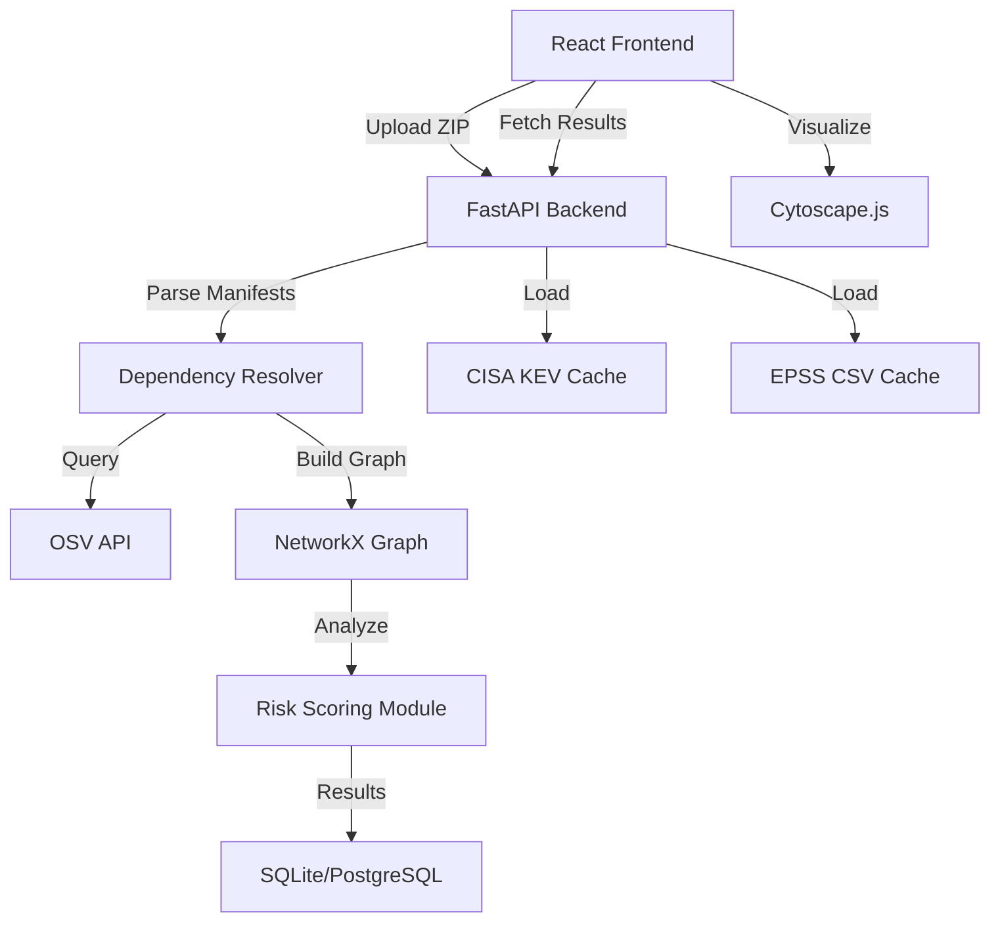

<div align="center">
  

  <h1>MARGVEDHA</h1>
  
  <p><strong>M</strong>apping <strong>A</strong>nd <strong>R</strong>isk <strong>G</strong>raph for <strong>V</strong>ulnerability <strong>E</strong>valuation, <strong>D</strong>etection & <strong>H</strong>ardening <strong>A</strong>pplications</p>

  <p><em>Trace the Risk. Secure the Path.</em></p>

  <p>
    <a href="https://reactjs.org/"></a>
    <a href="https://www.typescriptlang.org/"></a>
    <a href="https://tailwindcss.com/"></a>
    <a href="https://js.cytoscape.org/"></a>
    <a href="https://fastapi.tiangolo.com/"></a>
    <a href="https://networkx.org/"></a>
  </p>
</div>

<hr />

## 📋 Table of Contents
1. [Executive Summary](#-executive-summary)
2. [Problem Statement](#-problem-statement)
3. [Proposed System & Contributions](#-proposed-system--contributions)
4. [Key Technical Capabilities](#-key-technical-capabilities)
5. [System Architecture](#-system-architecture)
6. [Datasets & Data Sources](#-datasets--data-sources)
7. [Academic Backing & Literature Review](#-academic-backing--literature-review)
8. [Getting Started (Demo Mode)](#-getting-started-demo-mode)
9. [Limitations & Future Scope](#-limitations--future-scope)
10. [References](#-references)

---

## 🎯 Executive Summary

**MARGVEDHA** is an evidence-based, interactive software supply-chain security platform developed for the **CISA** challenge. While traditional Software Composition Analysis (SCA) tools excel at detecting vulnerable packages, they frequently leave developers overwhelmed with flat lists of false positives. 

MARGVEDHA transforms raw dependency data (lockfiles) and vulnerability advisories (OSV.dev) into a fully interactive, explainable propagation graph. By explicitly differentiating between *advisory presence*, *structural reachability*, and integrating exploit intelligence (CISA KEV, EPSS), we empower security and engineering teams to identify the exact transitive path of a vulnerability and simulate the organizational impact of their patches before applying them.

---

## 🛡️ Problem Statement

**Challenge:** CSB-03 — Supply-Chain Vulnerability Propagation Graph
**Associated Organization:** CISA (Cybersecurity and Infrastructure Security Agency)

> *"A single vulnerable open-source package can silently affect thousands of downstream applications. Security teams struggle to see how far a newly disclosed CVE has actually propagated through their dependency tree.* 
> 
> *Expected Solution: Given a sample set of software manifests (`package.json`/`requirements.txt`/`pom.xml`) and a CVE feed, build a dependency graph that highlights all directly and transitively affected projects, ranks them by exploitability/exposure, and suggests a patch order."*

---

## 💡 Proposed System & Contributions

Our competitive analysis identified that the SCA landscape (OSV-Scanner, Snyk, Dependabot) is mature regarding initial detection. Therefore, MARGVEDHA's defensible novelty lies entirely in **developer-facing explainability and remediation planning**.

**Our Defensible Contributions:**
1. **Explainable Multi-Project Propagation Graph**: Visualizing not just *that* a project is affected, but exactly *how* the CVE flows through intermediate dependencies using Cytoscape.js.
2. **Interactive Remediation Planner**: An interface that calculates an optimal patch order and provides a before-and-after graph simulation to visualize risk reduction prior to execution.
3. **Evidence-Tiered Labeling**: Abandoning binary "vulnerable/safe" labels in favor of evidence states (`ADVISORY_MATCH`, `PROJECT_CONTAINS`, `PATH_REACHABLE`) to prevent alert fatigue.

---

## ✨ Key Technical Capabilities

### 1. Explainable Graph Traversal
MARGVEDHA utilizes NetworkX and Cytoscape.js to build a directed graph `G = (V, E)`. Users can trace the exact path from a root project node down through multiple `PackageVersion` nodes, terminating at a known `Vulnerability` node, giving explicit context to transitive risks.

### 2. Evidence-Tiered Risk Scoring
We implement a multi-factor, configurable risk scoring heuristic that prevents CVSS over-reliance. The score aggregates:
- **CVSS Severity Base Score** (Intrinsic impact)
- **CISA KEV (Known Exploited Vulnerabilities) Membership** (Binary indicator of active exploitation)
- **FIRST EPSS Score** (Machine learning-driven probability of exploitation within 30 days)
- **Topology & Depth** (Direct vs. Transitive dependency status)
- **Fix Availability** (Actionability modifier)

### 3. "What-If" Fix Simulation
MARGVEDHA acts as a patch planner. When a developer selects a candidate upgrade (e.g., upgrading `lodash` from `4.17.19` to `4.17.21`), the platform simulates the graph update, calculates the total risk reduced, and visually highlights which CVEs vanish across all connected repositories simultaneously.

### 4. Cross-Project Clustering
By parsing manifests across an entire workspace, MARGVEDHA clusters shared vulnerable dependencies. This identifies "choke points"—packages that, if upgraded once, remediate vulnerabilities across multiple independent applications.

---

## 🏗️ System Architecture

MARGVEDHA is built using a decoupled, API-first architecture designed to scale from a local hackathon prototype to a cloud-native deployment.



### Components
- **Frontend**: React, TypeScript, Vite, Tailwind CSS v4, Lucide Icons.
- **Graph Visualization**: Cytoscape.js (`react-cytoscapejs`).
- **Backend (Planned)**: Python, FastAPI for handling REST requests, NetworkX for in-memory graph traversal.

---

## 📊 Datasets & Data Sources

MARGVEDHA heavily leverages standard, verifiable vulnerability intelligence feeds:

| Data Source | Purpose | Cadence | Relevance |
|-------------|---------|---------|-----------|
| **[OSV.dev](https://osv.dev/)** | Primary vulnerability matching and database. | Continuous | Highly accurate ecosystem-aware version comparisons. |
| **[CISA KEV](https://www.cisa.gov/known-exploited-vulnerabilities-catalog)** | Binary exploit evidence signal. | Weekly | Maximum priority signal for remediation. |
| **[FIRST EPSS](https://www.first.org/epss/)** | Probabilistic exploit likelihood scoring. | Daily | Distinguishes between theoretical CVSS scores and actual threat context. |

---

## 📚 Academic Backing & Literature Review

Our system design was guided by state-of-the-art academic research into software supply-chain networks:

1. **Graph Construction**: Supported by *Liu et al. (ICSE 2022)*, establishing that dependency tree resolution is necessary for accurate propagation mapping over static manifest scanning.
2. **Prioritization Framework**: Supported by *Vulnerability Management Chaining (arXiv 2025)*, validating that the intersection of CVSS + EPSS + KEV significantly reduces false positives while maintaining coverage.
3. **Graph-Theoretic Vulnerability Assessment**: Supported by *VDGraph (ACM 2026)*, confirming that vulnerabilities predominantly emerge at depth ≥ 3, necessitating transitive path visualization.

---

## 🚀 Getting Started (Demo Mode)

The current iteration boots entirely offline into a deterministic **Demo Mode**. It includes pre-computed graph fixtures simulating a resolved Python and npm workspace to allow instant demonstration of the UI, Graph Traversal, and Remediation Simulation without API rate limits.

### Prerequisites
- [Node.js](https://nodejs.org/) (v18+)
- npm (v9+)

### Installation

```bash
# Clone the repository
git clone https://github.com/Aditya948351/CSB_03_MargVedha.git
cd CSB_03_MargVedha/frontend

# Install dependencies
npm install

# Start the local development server
npm run dev
```

Navigate to `http://localhost:5173` to interact with the MARGVEDHA platform.

---

## ⚠️ Limitations & Future Scope

In the spirit of honest, evidence-based security engineering, MARGVEDHA acknowledges the following boundaries:

- **Static vs. Runtime Reachability**: MARGVEDHA calculates structural *path reachability*. We do not currently generate Call Flow Graphs (CFGs) to prove that vulnerable functions are invoked at runtime.
- **Manifest Limitations**: While `package.json` provides direct dependencies, accurate transitive graphs require lockfiles (`package-lock.json`, `poetry.lock`). If only a manifest is provided, MARGVEDHA limits its graph to direct dependencies.
- **Resolver Verification**: Simulated upgrades are advisory-based. Future integrations will require CI-pipeline execution to guarantee that a suggested version bump does not introduce breaking code changes.

---

## 📖 References

1. CISA Known Exploited Vulnerabilities Catalog. (2025). [https://www.cisa.gov/known-exploited-vulnerabilities-catalog](https://www.cisa.gov/known-exploited-vulnerabilities-catalog)
2. FIRST Exploit Prediction Scoring System (EPSS). [https://www.first.org/epss/](https://www.first.org/epss/)
3. OSV.dev. Open Source Vulnerabilities. [https://osv.dev/](https://osv.dev/)
4. Ruan et al. (2025). *Propagation-Based Vulnerability Impact Assessment for Software Supply Chains*. arXiv:2506.01342.
5. Xia, H., et al. (2025). *VDGraph: A Graph-Theoretic Approach to Unlock Insights from SBOM and SCA Data*. arXiv:2507.20502.

<div align="center">
  <br />
  <p><strong>Developed for the CISA Hackathon Challenge</strong></p>
</div>
