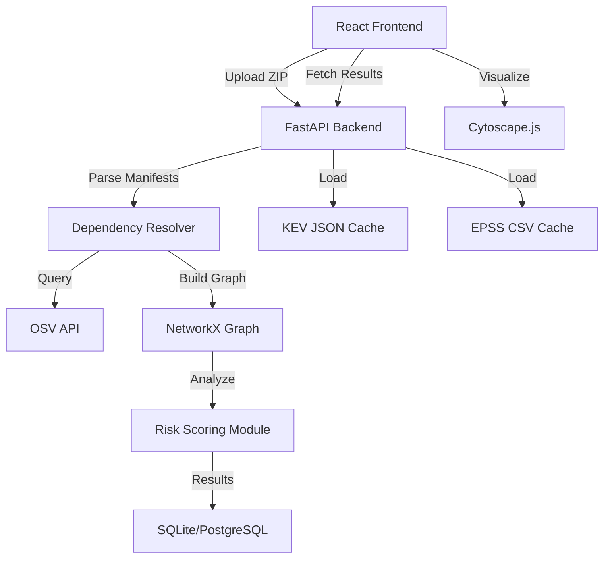

# MARGVEDHA Architecture

## System Overview

MARGVEDHA is designed as a two-layer system to preserve a clear path from hackathon prototype to production tool:

1.  **Layer A (Demonstration Experience)**: A React-based frontend that provides a premium, interactive UI for exploring dependency graphs and vulnerability paths.
2.  **Layer B (Analysis Foundation)**: A planned Python-based backend that handles manifest parsing, vulnerability matching, and graph traversal.

## High-Level Architecture (Planned)

## Component Responsibilities

*   **Frontend (React + Tailwind + Cytoscape.js)**: File upload, graph visualization, findings table, remediation planner UI.
*   **Backend (FastAPI)**: File handling, manifest parsing, OSV/KEV/EPSS integration, graph analysis, risk scoring.
*   **Graph Engine (NetworkX)**: Graph construction, path traversal, centrality metrics.
*   **Persistence (SQLite)**: Scan history and result storage.

## Data Flow (Prototype vs. Production)

**Current Prototype Flow:**
The frontend loads deterministic fixtures (`demoData.ts`) matching the data contracts. The user explores the pre-calculated graph and simulated remediation results.

**Target Production Flow:**
1. User uploads a ZIP archive containing manifests and lockfiles.
2. Backend parses files to extract dependency nodes and edges.
3. Backend queries OSV.dev to find vulnerability matches for package versions.
4. Backend uses NetworkX to traverse the graph and identify paths from root projects to vulnerable packages.
5. Backend calculates a risk score based on CVSS, KEV membership, EPSS, and topology.
6. Backend returns a `ScanResult` payload matching the prototype's contracts.

## Service Boundaries

The application is structured around these explicit service boundaries:
- `Project Import`: Validating and extracting archives.
- `Manifest Parsing`: Extracting `(ecosystem, package, version)` tuples.
- `Vulnerability Lookup`: Batch querying OSV.dev.
- `Graph Traversal`: Finding shortest paths and affected downstream projects.
- `Remediation Simulation`: Producing a before/after graph state.
